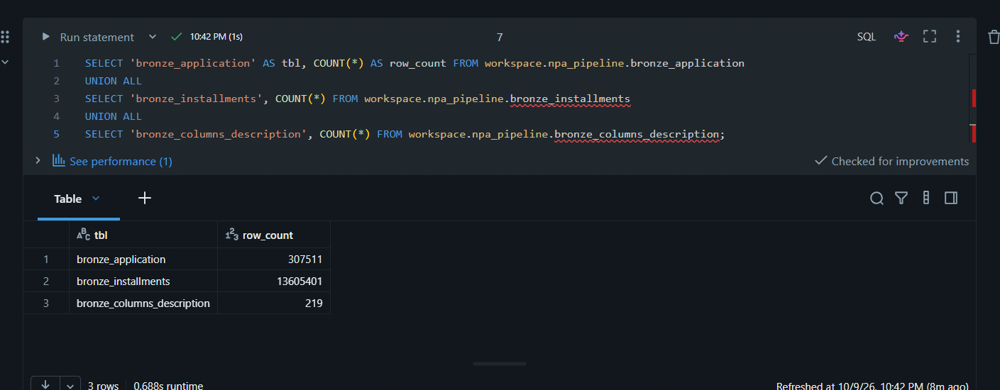
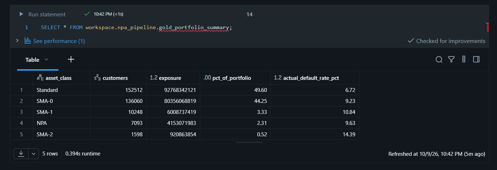

# NPA & Credit Risk Classification Pipeline

I built this project to learn how a lending company might track loans that are going bad. It takes raw loan and repayment data, cleans it, and sorts every customer into a delinquency stage (Standard, SMA-0, SMA-1, SMA-2 or NPA) using the RBI days-past-due rules.

Everything is written in SQL on Databricks Free Edition, using the Bronze / Silver / Gold layout.

Dataset: Home Credit Default Risk (Kaggle)

---

## Architecture

```
  Kaggle CSV files
  - application_train.csv
  - installments_payments.csv
  - HomeCredit_columns_description.csv
          |
          |  uploaded to a Databricks Volume
          v
  /Volumes/workspace/bronze/raw_files/
          |
          |  read_files()
          v
  +-------------------------------------------------+
  | BRONZE  (raw copy, nothing changed)             |
  |   bronze_application                            |
  |   bronze_installments                           |
  |   bronze_columns_description                    |
  +-------------------------------------------------+
          |
          |  clean, fix types, add new columns
          v
  +-------------------------------------------------+
  | SILVER  (cleaned data)                          |
  |   silver_application                            |
  |   silver_installments                           |
  +-------------------------------------------------+
          |
          |  join on SK_ID_CURR, calculate DPD,
          |  assign asset class
          v
  +-------------------------------------------------+
  | GOLD  (final output)                            |
  |   gold_customer_npa                             |
  |   gold_portfolio_summary                        |
  +-------------------------------------------------+
```

All tables are in the schema `workspace.npa_pipeline`.

---

## What happens in each layer

### Bronze
The CSV files are loaded as they are into Delta tables. I only added two columns, `_ingested_at` and `_source_file`, so I can tell when and where each row came from. The column description file is read with ISO-8859-1 encoding because it has special characters.

### Silver
This is where the cleaning happens.

- `DAYS_EMPLOYED = 365243` is not a real value. It means the person is not employed, so I changed it to NULL.
- The day columns are negative in the source (days before the application date), so I converted them to positive years: `age_years` and `years_employed`.
- Added `credit_to_income` (credit amount divided by income). I used NULLIF so it does not break on zero income.
- Removed rows with no customer ID or a credit amount of 0.
- Removed duplicate rows in the installments table.
- Worked out `days_past_due` for each installment: payment date minus due date, and never below 0.
- Worked out `shortfall_amt`: how much of the installment was left unpaid. If there is no payment, it counts as 0 paid.

### Gold
For each customer, I take the highest days past due and the total unpaid amount from the installments, then join that to the application data. Customers with no installment history get 0 DPD.

The asset class is decided like this:

| Asset class | Days past due |
|-------------|---------------|
| Standard    | 0             |
| SMA-0       | 1 to 30       |
| SMA-1       | 31 to 60      |
| SMA-2       | 61 to 90      |
| NPA         | more than 90  |

The last table, `gold_portfolio_summary`, groups customers by asset class and shows how many customers there are, the total credit amount, the share of the portfolio, and the actual default rate from the `TARGET` column.

---

## Tables

| Layer  | Table                      | What it holds                                    |
|--------|----------------------------|--------------------------------------------------|
| Bronze | bronze_application         | Raw loan applications                            |
| Bronze | bronze_installments        | Raw installment payments                         |
| Bronze | bronze_columns_description | Column descriptions of the dataset               |
| Silver | silver_application         | Cleaned applications with age, years employed, credit to income |
| Silver | silver_installments        | Cleaned installments with days past due and shortfall |
| Gold   | gold_customer_npa          | One row per customer with max DPD and asset class |
| Gold   | gold_portfolio_summary     | Summary by asset class                           |

---

## Files in this repo

```
npa-credit-risk-pipeline/
  NPA_PROJECT_BEGINNER.ipynb    the full notebook
  README.md
  .gitignore
  screenshots/                  output screenshots
```

---

## How to run it

1. Download the three CSV files from the Kaggle Home Credit Default Risk dataset.
2. Upload them to a Databricks Volume at `/Volumes/workspace/bronze/raw_files/` (or change the paths in the notebook).
3. Import `NPA_PROJECT_BEGINNER.ipynb` into Databricks.
4. Run the cells from top to bottom. The installments file is around 690 MB, so the Bronze and Silver steps take a few minutes.
5. Check the result with: `SELECT * FROM workspace.npa_pipeline.gold_portfolio_summary;`

---

## Results

Row counts after loading Bronze:



Final portfolio summary:



---

## Limitations

- The dates in this dataset are anonymized and relative, so the days past due here is calculated from payment date minus due date. It is an approximation and not real loan ledger data.
- I only used two tables from the dataset (applications and installments). The bureau and previous application tables are not used.
- The classification is rule based. There is no machine learning model in this project.

## Ideas for later

- Use the other Home Credit tables
- Schedule the notebook as a Databricks Job
- Add data quality checks between layers
- Make a dashboard on the Gold tables

---

Data is not included in this repo. Get it from Kaggle: Home Credit Default Risk.

Author: Bablu, NIT Warangal
